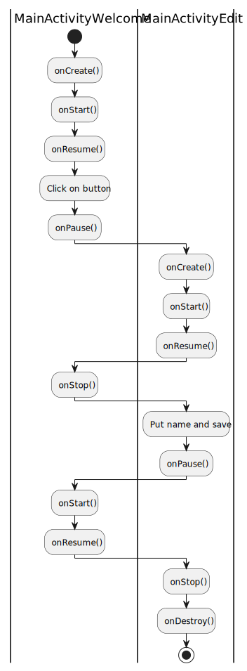
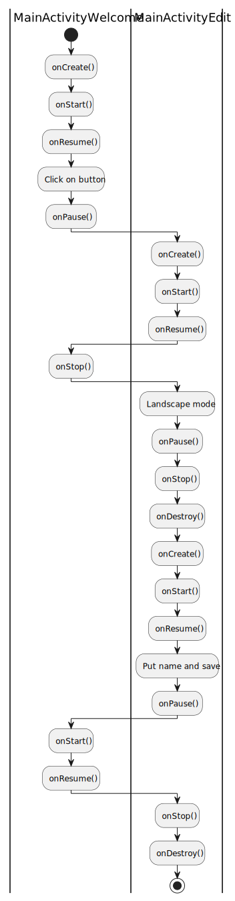

# Labo 2

_**Furrer Patrick, Guggisberg Simon et Troeltsch Jonas**_

## Introduction

Ce laboratoire consiste en une première prise en main et expérimentation autour des activités et des fragments.

Afin de lancer chacune des parties, il convient de modifier le AndroidManifest.xml selon les besoins.
- Veuiller changer la valeur android:name selon celle de la partie, et activité, souhaitée, celles-ci étant mentionnées dans le manifest. 
- De plus la partie 1 requière de décommenter certaines parties du manifest.

## Partie 1

#### Que se passe-t-il si l’utilisateur appuie sur « back » lorsqu’il se trouve sur la seconde Activité ?

L'utilisateur revient à l'activité précédente sur la pile, ici la première.

#### Veuillez réaliser un diagramme des changements d’état des deux Activités pour les utilisations suivantes, vous mettrez en évidence les différentes instances de chaque Activité :

L’utilisateur ouvre l’application, clique sur le bouton éditer, renseigne son prénom et sauve.

L’utilisateur ouvre l’application en mode portrait, clique sur le bouton éditer, bascule en mode paysage, renseigne son prénom et sauve.

#### Que faut-il mettre en place pour que vos Activités supportent la rotation de l’écran ? Est-ce nécessaire de le réaliser pour les deux Activités, quelle est la différence ?

_Hint : Que se passe-t-il si on bascule la première Activité après avoir saisi son prénom ? Comment peut-on éviter ce comportement indésirable ? Quelle est la différence avec la seconde Activité ?_

Il faut mettre en place la sauvegarde/chargement de l'état de l'activité, ici le nom de l'utilisateur. Ceci se fait au travers de la méthode onCreate et onRestoreInstanceState, via un bundle.

#### Implémentation

Pour faciliter le tracking des événement qui se produisent, nous avons ajouté des logs dans les classes "MainActivityEdit" et "MainActivityWelcome".
De plus, pour pouvoir gérer le passage du nom entre les deux activités, nous avons utiliser un contrat "PickNameContract".
Cette classe est responsable de récupérer le nom dans "MainActivityEdit" et de le passer à "MainActivityWelcome".

## Partie 2

#### Les deux Fragments fournis implémentent la restauration de leur état. Si on enlève la sauvegarde de l’état sur le ColorFragment sa couleur sera tout de même restaurée, comment pouvons-nous expliquer cela ? 

Les informations étant sont enregistrées dans le Bundle, celui-ci peut les passer en argument à la fonction onCreate. Ceci se fait de manière indépendant de l'usage de onSaveInstanceState.

####  Si nous plaçons deux fois le CounterFragment dans l’Activité, nous aurons deux instances indépendantes de celui-ci. Comment est-ce que la restauration de l’état se passe en cas de rotation de l’écran ? 

Chaque instance de ces Fragments sont indépendantes et possèdent un identifiant unique. Ceci permet de sauvegarder les informations de manière indépendante dans le Bundle et donc récupérer les informations de manière individuelle.
Les deux instances sont donc sauvegardé indépendamment, puis restauré grâce a leur identifiant unique.

On peut facilement observer ce comportement en imprimant l'id dans le terminal lors des divers étapes de création d'objet.

## Partie 3

#### A l’initialisation de l’Activité, comment peut-on faire en sorte que la première étape s’affiche automatiquement ?

Il suffit de rajouter le fragment dans le layout de l'activité, ou de le rajouter lors de la création de l'activité.

#### Comment pouvez-vous faire en sorte que votre implémentation supporte la rotation de l’écran ? Nous nous intéressons en particulier au maintien de l’état de la pile de Fragments et de l’étape en cours lors de la rotation.

En implémentant onSaveInstanceState et onRestoreInstanceState, on peut sauvegarder l'état du  fragment, à la manière du fragment Counter donné en exemple pour le point 2.

#### Dans une transaction sur le Fragment, quelle est la différence entre les méthodes add et replace ?

Replace supprime le fragment précédent, Add le rajoute au layout, sans l'afficher au dessus du précédent.

#### Implémentation

Nous avons 2 classes pour cette partie :
- "MainActivityFragment2" qui est l'activité principale. Elle est chargée de mettre en place le layout, ainsi que de des fonctionalités des boutons. Pour gérer la pile de fragment, nous utilisons supportFragmentManager une fonctionalité native.
- SimpleFragment, qui contient principalement sa propre id. Nous avons décider de passer par une création statique de notre instance, visible au niveau de la JVM. Cela nous permet d'utiliser et stocker l'id dans le Bundle.
Le fragment contient en lui même le bouton "Increment". Celui-ci incrémente le compteur interne au fragment et non son id.
Nous avons choisi de ne pas sauvegarder les fragments lorsque le bouton "Back" est pressé. Ce choix est dû à l’utilisation d'une pile plutôt qu'un tableau pour représenter les fragments.

## Conclusion

L'utilisation des activités, fragment, intent et contrats est vitale pour le développement Android.
Les application complexes demande de pousser la réflexion sur l'utilisation de ces outils, et ce laboratoire nous a permis de développer une certain sensibilité sur le sujet.
